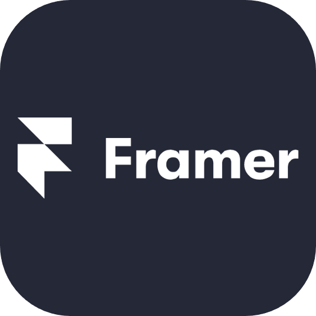

<h1 align="center">Hi 👋, I'm Kavin</h1>
<h3 align="center">A passionate frontend developer from Singapore</h3>

<h3 align="center">About me:</h3>

As a software engineer trained at General Assembly's Software Engineering Immersive program in Singapore, I am passionate about developing aesthetic and functional web applications. With a good foundation in HTML, CSS, and React, and a commitment to continuous learning, I strive to create dynamic and responsive websites.

<h3 align="center">Connect with me:</h3>

<h3 align="center">Languages and Tools:</h3>

 

  

  

  

<!--
**kavinned/kavinned** is a ✨ _special_ ✨ repository because its `README.md` (this file) appears on your GitHub profile.

Here are some ideas to get you started:

- 🔭 I’m currently working on...
- 🌱 I’m currently learning...
- 👯 I’m looking to collaborate on...
- 🤔 I’m looking for help with...
- 💬 Ask me about...
- 📫 How to reach me:...
- 😄 Pronouns:...
- ⚡ Fun fact:...
-->
